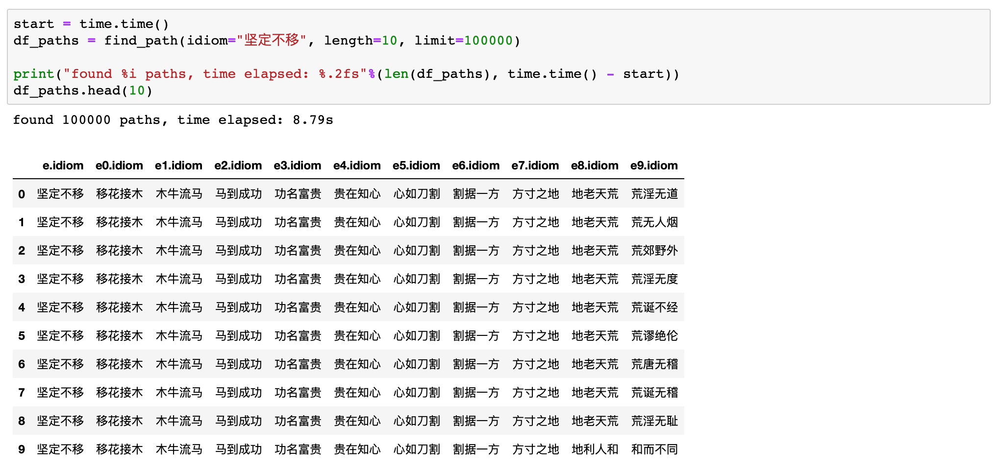

### Idiom Graph - 成语接龙

This repository uses neo4j graph database server to build a idiom graph. Given a Chinese idiom, the goal is to find another idiom whose first character matches the last character of the given idiom. The process continues.

Structure of graph:
* Node: every character located at the beginning or end of an idiom creates a node
* Edge: every idiom creates a **directed** edge, pointing from the last character (source node) of an idiom to the beginning character (destination node) of another idiom.

Two versions are implemented. The first version only requires pinyin(拼音) match (left graph). The second version requires exact character match (right graph).

|                | Nodes     | Edges
| :------------- | :-------- | :---
| Version 1      | 382       | 7874
| Version 2      | 2507      | 7874

Note that there are 2507 distinct Chinese characters located at the beginning or end of idioms (2507 nodes in version 2). Those characters have 382 pronunciations (382 nodes in version 1). The number of edges is the same in both versions, because the number of idioms is the same. Graph 1 is denser than graph 2.

___
#### Implementation
* Version 1: pinyin/pronounciation match [[idiom_graph_v1.ipynb](idiom_graph_v1.ipynb)]
* Version 2: exact character match [[idiom_graph_v2.ipynb](idiom_graph_v2.ipynb)]

Sample query result: [output/坚定不移.csv](output/坚定不移.csv)

    

