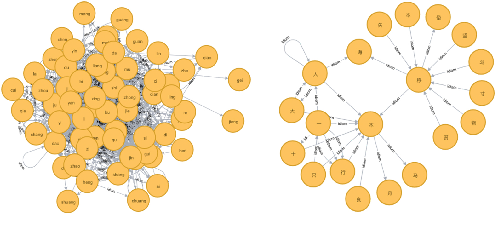
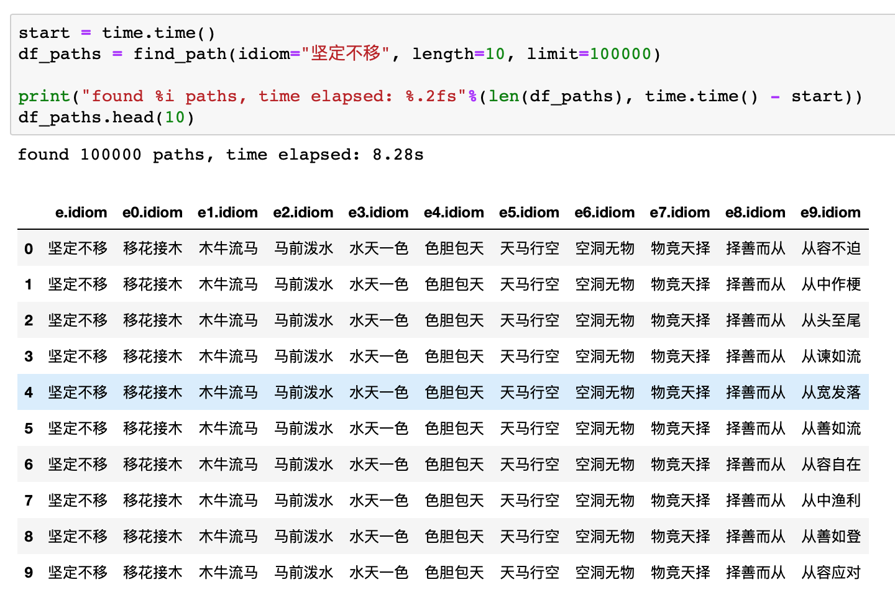

### Idiom Graph - 成语接龙

This repository uses neo4j graph database server to build a idiom graph. Given a Chinese idiom, the goal is to quickly find another idiom whose first character matches the last character of the given idiom.

Structure of graph:
* Node: every character located at the beginning or end of an idiom
* Edge: an idiom creates a **directed** edge, pointing from the last character of an idiom to the beginning character of another idiom.

Two versions are implemented. The first version only requires pinyin(拼音) match. The second version requires exact character match.

|                | Nodes     | Edges
| :------------- | :-------- | :---
| Version 1      | 382       | 7874
| Version 2      | 2507      | 7874

Note that there are 2507 distinct Chinese characters located at the beginning or end of idioms. Those characters have only 382 pronunciations. The number of edges is the same in both versions, because the number of idioms is the same. Graph 1 is denser than graph 2.

___
#### Implementation
* Version 1: [[idiom_graph_v1.ipynb](idiom_graph_v1.ipynb)]
* Version 2: [[idiom_graph_v2.ipynb](idiom_graph_v2.ipynb)]

